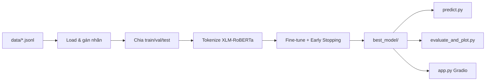

# Hướng dẫn huấn luyện & kết quả thực nghiệm

Tài liệu mô tả cách huấn luyện mô hình **XLM-RoBERTa-base** phát hiện văn bản do máy sinh (Machine-Generated Text Detection) trên tập **M4**, cùng kết quả thực nghiệm đã chạy trên máy local.

---

## 1. Tổng quan bài toán

| Hạng mục | Mô tả |
|----------|--------|
| **Đầu vào** | Một đoạn văn bản (tiếng Việt hoặc tiếng Anh) |
| **Đầu ra** | Nhãn nhị phân: `0` = Human, `1` = Machine |
| **Backbone** | [`xlm-roberta-base`](https://huggingface.co/xlm-roberta-base) |
| **Dataset** | M4 — 28 file `.jsonl` trong thư mục `data/` |

### Cấu trúc nhãn trong file JSONL

Mỗi dòng gồm các trường: `prompt`, `human_text`, `machine_text`, `model`, `source`, `source_ID`.

- Có `machine_text` → nhãn **Machine** (`label = 1`), dùng nội dung đó làm input.
- Không có `machine_text` → nhãn **Human** (`label = 0`), lấy từ `human_text` hoặc các trường văn bản khác.

Chi tiết quy ước tên file: xem [`data/README.md`](data/README.md).

---

## 2. Chuẩn bị môi trường

### 2.1. Yêu cầu phần cứng

| Thành phần | Khuyến nghị |
|------------|-------------|
| **GPU** | NVIDIA ≥ 8 GB VRAM (đã thử trên RTX 3060, CUDA 11.8) |
| **RAM** | ≥ 16 GB |
| **Ổ đĩa** | ~2 GB (dataset + model checkpoint) |

### 2.2. Cài đặt thư viện

```bash
# Clone repo
git clone https://github.com/thanhtien2k5/XLM-Roberta.git
cd XLM-Roberta

# Tạo môi trường ảo (khuyến nghị)
python -m venv venv
# Windows:
venv\Scripts\activate
# Linux/macOS:
# source venv/bin/activate

# PyTorch + CUDA (chạy trước)
pip install torch torchvision torchaudio --index-url https://download.pytorch.org/whl/cu118

# Các thư viện còn lại
pip install -r requirements.txt
```

### 2.3. Kiểm tra GPU

```bash
cd codetrain
python testgpu.py
```

---

## 3. Dữ liệu huấn luyện

### 3.1. Thống kê tập M4 (đã kiểm tra)

| Chỉ số | Giá trị |
|--------|---------|
| Số file `.jsonl` | 28 |
| Tổng mẫu hợp lệ | **67.963** |
| Human | 1.780 (2,6%) |
| Machine | 66.183 (97,4%) |
| Độ dài text (ký tự) | min = 4, max = 14.807, **mean ≈ 1.691** |

> **Lưu ý:** Dữ liệu **lệch lớp** nặng (Machine >> Human). Cần cân bằng hoặc dùng loss có trọng số khi train.

### 3.2. Domain & model nguồn

| Domain | Ví dụ file |
|--------|------------|
| `wikipedia` | `wikipedia_chatgpt.jsonl`, `wikipedia_davinci.jsonl`, … |
| `wikihow` | `wikihow_bloomz.jsonl`, `wikihow_chatGPT.jsonl`, … |
| `reddit` | `reddit_bloomz.jsonl`, `reddit_cohere.jsonl`, … |
| `arxiv` | `arxiv_bloomz.jsonl`, `arxiv_flant5.jsonl`, … |
| `peerread` | `peerread_llama.jsonl`, `peerread_dolly.jsonl`, … |

Model sinh văn bản: ChatGPT, Davinci, Cohere, Dolly, Bloomz, Flan-T5, LLaMA, …

---

## 4. Hai pipeline huấn luyện

Repo cung cấp **hai script** chính trong `codetrain/`:

| Script | Đặc điểm | Output mặc định |
|--------|----------|-----------------|
| [`train_m4_xlmr.py`](codetrain/train_m4_xlmr.py) | Weighted Cross-Entropy, `max_length=256`, gradient checkpointing | `./xlmr-m4-vi-en/best_model` |
| [`train_m4_xlmr_final.py`](codetrain/train_m4_xlmr_final.py) | **Focal Loss** + weighted CE, cân bằng Human:Machine = **1:2**, `max_length=512` | `./best_model_final` |

### 4.1. Huấn luyện cơ bản — `train_m4_xlmr.py`

```bash
cd codetrain
python train_m4_xlmr.py --data_dir ../data --output_dir ../xlmr-m4-vi-en
```

**Tham số CLI:**

| Tham số | Mặc định | Ý nghĩa |
|---------|----------|---------|
| `--data_dir` | `../data` | Thư mục chứa file `.jsonl` |
| `--output_dir` | `./xlmr-m4-vi-en` | Thư mục lưu checkpoint |
| `--epochs` | `3` | Số epoch |
| `--batch_size` | `4` | Batch size / GPU |
| `--grad_accum` | `4` | Gradient accumulation (effective batch = 16) |
| `--max_length` | `256` | Độ dài token tối đa |
| `--no_fp16` | — | Tắt mixed precision FP16 |

**Siêu tham số cố định trong code:**

- Learning rate: `2e-5`
- Loss: Cross-Entropy có trọng số lớp `[1.0, 1.2]` (ưu tiên nhận diện Machine)
- Chia dữ liệu: 80% train / 10% validation / 10% test
- Early stopping: patience = 2 epoch
- Metric chọn model tốt nhất: **F1 macro**

### 4.2. Huấn luyện nâng cao — `train_m4_xlmr_final.py`

```bash
cd codetrain
python train_m4_xlmr_final.py
# Script mặc định đọc data từ ../data khi chạy từ codetrain/
# Hoặc sửa data_dir="data" trong code thành "../data"
```

**Khác biệt so với bản cơ bản:**

1. **Cân bằng dữ liệu:** giữ toàn bộ Human, subsample Machine theo tỷ lệ 1:2.
2. **Focal Loss** (α=0.25, γ=2) kết hợp Weighted CE (tỷ lệ 65% / 35%).
3. Trọng số lớp: `[3.5, 1.0]` — tăng mạnh trọng số lớp Human.
4. `max_length = 512`, effective batch = 4 × 4 = 16.

**Siêu tham số:**

| Tham số | Giá trị |
|---------|---------|
| Epochs | 3 |
| Learning rate | 2e-5 |
| Weight decay | 0.01 |
| Warmup ratio | 0.1 |
| FP16 | Bật |
| Chia dữ liệu | 72% train / 8% val / 20% test |

---

## 5. Kết quả thực nghiệm

### 5.1. Kết quả `train_m4_xlmr.py` (checkpoint tốt nhất)

Huấn luyện trên GPU local, backbone **xlm-roberta-base**, 3 epoch, metric chọn theo **F1 macro** trên tập validation.

| Epoch | Accuracy (val) | **F1 macro (val)** | Loss (val) |
|-------|----------------|---------------------|------------|
| 1 | 99,62% | 87,91% | 0,023 |
| 2 | 99,69% | 91,45% | 0,016 |
| **3** | **99,73%** | **92,28%** | 0,017 |

**Checkpoint tốt nhất:** `global_step = 9576` (epoch 3)  
**Đường dẫn model:** `xlmr-m4-vi-en/best_model/` (lưu local, không đẩy lên Git vì dung lượng lớn)

> Accuracy rất cao (~99,7%) phản ánh **mất cân bằng lớp** (dự đoán Machine cho hầu hết mẫu vẫn đúng). **F1 macro** là metric đáng tin cậy hơn trong bối cảnh này.

### 5.2. Nhận xét định tính

| Khía cạnh | Quan sát |
|-----------|----------|
| **Điểm mạnh** | Phân biệt tốt văn bản Machine có văn phong “AI” (formal, template WikiHow/arxiv) |
| **Human tiếng Việt tự nhiên** | Câu ngắn, văn nói — dễ bị nhầm sang Machine nếu không đủ dữ liệu Human |
| **Human tiếng Anh học thuật** | Văn phong trang trọng — đôi khi bị over-predict Machine |
| **Cải thiện** | Dùng `train_m4_xlmr_final.py` (Focal Loss + cân bằng 1:2) để tăng recall lớp Human |

### 5.3. Đánh giá & vẽ biểu đồ sau train

```bash
cd codetrain

# Dự đoán nhanh trên văn bản
python predict.py --model_path ../xlmr-m4-vi-en/best_model --text "Văn bản cần kiểm tra"

# Đánh giá toàn tập + vẽ Confusion Matrix, ROC, F1 theo ngôn ngữ
python evaluate_and_plot.py

# Sinh đủ 9 hình cho khóa luận (lý thuyết + thực nghiệm)
python generate_all_figures.py
```

Trước khi chạy `evaluate_and_plot.py`, sửa trong file:

```python
MODEL_PATH = "../xlmr-m4-vi-en/best_model"
DATA_DIR = "../data"
```

**Các biểu đồ sinh ra:**

| File | Nội dung |
|------|----------|
| `figure_4_1_confusion_matrix.png` | Ma trận nhầm lẫn |
| `figure_4_2_roc_curve.png` | Đường ROC + AUC |
| `figure_4_3_f1_by_lang.png` | F1 so sánh tiếng Việt / tiếng Anh |

### 5.4. Giao diện demo (Gradio)

```bash
cd codetrain
# Sửa MODEL_PATH trong app.py trỏ tới best_model đã train
python app.py
```

Mở trình duyệt tại `http://127.0.0.1:7860`.

---

## 6. Sơ đồ quy trình huấn luyện



---

## 7. Cấu trúc thư mục sau khi train

```
XLM-Roberta/
├── data/                          # Dataset M4 (.jsonl)
├── codetrain/
│   ├── train_m4_xlmr.py           # Script train cơ bản
│   ├── train_m4_xlmr_final.py     # Script train Focal Loss + cân bằng
│   ├── predict.py                 # Inference
│   ├── evaluate_and_plot.py       # Đánh giá + biểu đồ
│   ├── generate_all_figures.py    # Sinh hình khóa luận
│   └── app.py                     # Demo Gradio
├── xlmr-m4-vi-en/                # (local) checkpoint & best_model
│   └── best_model/
├── best_model_final/              # (local) output train_m4_xlmr_final.py
├── requirements.txt
├── README.md
└── HUONG_DAN_TRAIN.md             # File này
```

---

## 8. Xử lý sự cố thường gặp

| Lỗi | Cách xử lý |
|-----|------------|
| `CUDA out of memory` | Giảm `--batch_size` xuống 2 hoặc `--max_length` xuống 128 |
| `Không load được record nào` | Kiểm tra `--data_dir` trỏ đúng thư mục có file `.jsonl` |
| F1 thấp dù Accuracy cao | Do lệch lớp — dùng `train_m4_xlmr_final.py` hoặc tăng trọng số Human |
| `No module named transformers` | Chạy lại `pip install -r requirements.txt` |
| Model không tải trong `app.py` | Đổi `MODEL_PATH` sang đường dẫn tương đối `../xlmr-m4-vi-en/best_model` |

---

## 9. Trích dẫn dataset

Nếu sử dụng tập M4 trong công trình học thuật, vui lòng trích dẫn bài báo gốc của benchmark M4 (Multilingual Multidomain Machine-Generated Text Detection).

---

## 10. Tóm tắt lệnh nhanh

```bash
git clone https://github.com/thanhtien2k5/XLM-Roberta.git
cd XLM-Roberta
pip install torch torchvision torchaudio --index-url https://download.pytorch.org/whl/cu118
pip install -r requirements.txt

cd codetrain
python train_m4_xlmr.py --data_dir ../data --output_dir ../xlmr-m4-vi-en
python predict.py --model_path ../xlmr-m4-vi-en/best_model --text "Your text here"
```

**Kết quả chính (train_m4_xlmr.py, epoch 3):** F1 macro validation = **92,28%**, Accuracy validation = **99,73%**.
